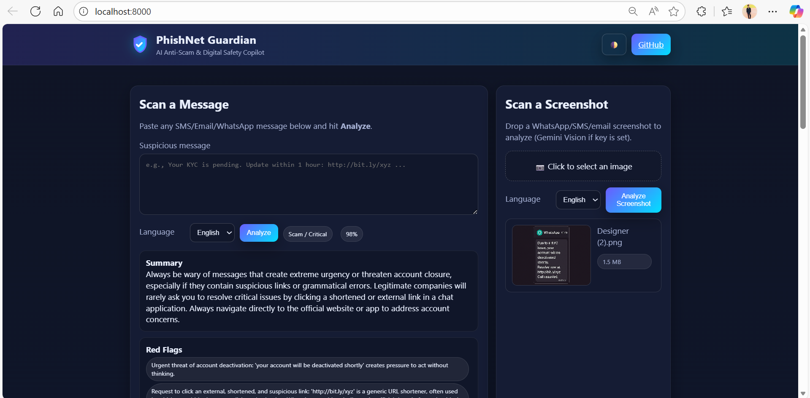

# PhishNet Guardian — Multi‑Agent Scam Detection (MVP)

**AMD Slingshot Hackathon Submission**  
**Team:** Radeon Rizers | **Lead:** Ritesh Raut  

**Theme:** AI + Cybersecurity & Privacy

**Problem Statement:** 
Detect and prevent phishing/scam messages (SMS/Email/WhatsApp/UPI/job scams) using explainable AI; provide safe actions and micro-training to reduce fraud.

---

# 🛡️ PhishNet Guardian — Multi‑Agent Scam Detection (MVP)

> **Detect + explain phishing/scam messages (SMS/Email/WhatsApp/UPI) with Gemini, then coach users with safe next steps.**  
> Agentic flow: **Intent → Analysis → Decision → Action**

---

## 🚀 Live Demo

Experience **PhishNet Guardian** live — zero installation needed!

---

### 🌐 Frontend (Netlify)
🔗 **Live UI:**  
https://phishnetmvp.netlify.app/

This is the interactive interface where users can paste suspicious messages or upload scam screenshots and get instant AI-powered analysis.

---

### 🧠 Backend API (Render – FastAPI)
🔗 **API Base URL:**  
https://phishnet-guardian-mvp.onrender.com

The backend handles:
- Text & image scanning  
- Gemini AI inference  
- Scam classification  
- Red‑flag reasoning  
- Micro‑lessons & quizzes  
- History storage (SQLite)  
- KPI stats  

> Your frontend communicates directly with this API, so both services must be live.

---

## 📘 API Documentation (Swagger)
Explore every endpoint interactively:  
https://phishnet-guardian-mvp.onrender.com/docs

---

## 🎥 Demo Video — PhishNet Guardian (MVP)

Watch the end‑to‑end demo of **PhishNet Guardian** in action 🚀  

▶️ **Demo Video Link:**  
🔗 https://drive.google.com/file/d/1p7aJgjlRjdh-aGkuMazIIueii6kqBfjw/view?usp=sharing

### What you’ll see in the demo:
- 📨 **Live phishing & scam detection** for SMS, Email, WhatsApp & UPI messages  
- 🧠 **Multi‑agent AI flow**: Intent → Analysis → Decision → Action  
- 🚩 **Explainable AI output** with red flags & confidence score  
- ✅ **Safe next‑step guidance** (Do / Don’t / Action Plan)  
- 📚 **Micro‑learning & quiz** to educate users instantly  
- 📊 **Dashboard & history tracking** in real time  

> ⚡ The demo showcases both **text analysis** and **screenshot‑based scam detection** using Gemini AI.

---

## ✨ Highlights

- **Text analysis** (`/api/scan`) and **Screenshot analysis** (`/api/scan-image`) — Gemini‑only, strict JSON
- **Multilingual output**: `en | hi | mr` (UI lets users choose)
- **Explainability**: red‑flags, recommended actions, not‑to‑do, plan, micro‑lesson, quiz, trace
- **Image upload preview**: instant thumbnail + file name/size before analyze
- **Dashboard** (totals + distribution) and **History** with CSV export
- **Light/Dark theme** toggle, persisted
- **SQLite** persistence (`phishnet.db`) — auto‑created on first run

---

## 🧱 Tech Stack

- **Frontend**: Vanilla HTML/CSS/JS (no build step)
- **Backend**: FastAPI (Python 3.11+), Uvicorn
- **AI**: Google Gemini (model set via `.env`)  
- **DB**: SQLite for MVP; ready to swap to Postgres/MySQL for prod

---

## 🗂️ Project Structure

```
phishnet-guardian-mvp/
├─ backend/
│  └─ app/
│     ├─ main.py           # FastAPI app: routes, DB, static mount
│     ├─ ai/
│     │  └─ agent.py       # Gemini-only text & vision calls; strict JSON
│     └─ utils/
│        └─ (optional helpers)
├─ frontend/
│  ├─ index.html           # UI: text + image forms, KPIs, history
│  └─ assets/
│     ├─ styles.css        # Theme system, components, preview block
│     └─ script.js         # API calls, quiz UX, image preview, stats
├─ requirements.txt        # FastAPI + Gemini SDK + dotenv
├─ .env.example            # Copy to .env and fill the keys
├─ phishnet.db             # SQLite DB (auto-created on first run); remove to reset
└─ README.md               # Documentation for automation
```

---

## ⚙️ Local Setup (Mac/Linux/WSL)

```bash
python -m venv .venv
source .venv/bin/activate
pip install -r requirements.txt
cp .env.example .env
# edit .env and set at least: GEMINI_API_KEY=...; optionally GEMINI_MODEL=gemini-2.5-flash
uvicorn backend.app.main:app --host 0.0.0.0 --port 8000 --reload
```

### 🪟 Windows (PowerShell)
```powershell
python -m venv .venv
. .venv\Scripts\Activate
pip install -r requirements.txt
Copy-Item .env.example .env
notepad .env   # set GEMINI_API_KEY, optionally GEMINI_MODEL=gemini-2.5-flash
uvicorn backend.app.main:app --host localhost --port 8000 --reload
```

Open **http://localhost:8000**

### 📸 UI Dashboard Preview



---

## 🔧 Configuration (.env)

```ini
# Required
GEMINI_API_KEY=your_key_here

# Optional — pick a model without code changes
# Common free-tier friendly choice that works for text + images
GEMINI_MODEL=gemini-2.5-flash
```

> ℹ️ If you see a 404 like *“model not found or not supported”*, your key/project may not have that model.  
> Change `GEMINI_MODEL` to a model you can access (e.g., `gemini-2.5-flash`), save, and **restart**.

---

## 🧪 Quick Checks

### 1) Text (curl)
```bash
curl -s -X POST http://localhost:8000/api/scan \
  -H 'Content-Type: application/json' \
  -d '{"text":"Your KYC will be blocked in 1 hour. Update at http://bit.ly/xyz","language":"en"}' | jq
```

### 2) Image (UI)
- Go to the **Screenshot** card → pick an image → preview appears → **Analyze Screenshot**.

### 3) Health & Meta
- `GET /api/health` — service time
- `GET /api/history` — recent runs
- `GET /api/history.csv` — CSV export
- `GET /api/stats` — totals + class distribution (for KPIs)

---

## 🔌 API Reference (MVP)

### `POST /api/scan`
**Body**
```json
{
  "text": "string (min 5 chars)",
  "language": "en|hi|mr (optional)"
}
```
**Response (excerpt)**
```json
{
  "classification": "Scam|Suspicious|Safe",
  "risk_level": "Low|Medium|High|Critical",
  "confidence": 0.0,
  "red_flags": ["..."],
  "recommended_actions": ["..."],
  "not_to_do": ["..."],
  "plan": ["..."],
  "micro_lesson": "...",
  "quiz": {"question":"...","options":["A","B"],"answer":"B","explanation":"..."},
  "trace": [{"stage":"Intent","notes":"..."}],
  "created_at": "2026-01-01T00:00:00Z"
}
```

### `POST /api/scan-image`
**FormData**
- `file` — image/*
- `language` — `en|hi|mr` (optional)

**Response** — same schema as `/api/scan`.

### `GET /api/history?limit=25`
```json
{ "items": [ {"id":1, "input_text":"...", ... } ], "count": 25 }
```

### `GET /api/stats`
```json
{ "total": 42, "distribution": {"Scam": 10, "Suspicious": 12, "Safe": 20} }
```

---

## 🧩 Frontend UX Notes

- **Theme toggle** persists via `localStorage` and updates `<html data-theme>`
- **Image preview** uses `URL.createObjectURL()` and shows name + size
- **Quiz** is clickable — options highlight correct/incorrect and show explanation
- **KPIs** refresh after each run and on page load

---

## 🗃️ Data Model (SQLite)

```sql
CREATE TABLE IF NOT EXISTS scans (
  id INTEGER PRIMARY KEY AUTOINCREMENT,
  input_text TEXT,
  classification TEXT,
  risk_level TEXT,
  confidence REAL,
  red_flags_json TEXT,
  actions_json TEXT,
  agent_trace_json TEXT,
  created_at TEXT
);
```

- Writes one row per analyze request (text or image)
- The dashboard and history read from this table

---

## 🛠️ Troubleshooting

- **500 with clear message in UI**  
  The backend now surfaces exact reasons (auth/quota/model/JSON/DB). Fix `.env`, model name, or network and restart.

- **Model not found (404)**  
  Set `GEMINI_MODEL=gemini-2.5-flash` (widely available), upgrade SDK (`pip install --upgrade google-generativeai`), restart.

- **History/KPIs stuck at 0**  
  Confirm the server writes to a single `phishnet.db` in project root and the app has write permission.

- **Windows stale imports**  
  Clear `__pycache__` and restart Uvicorn.

---

## 🧭 Environments & Deployment (suggested)

- **MVP**: Single Uvicorn process on a small VM/Container (e.g., 0.25–1 vCPU, 512 MB–1 GB RAM), SQLite, all‑in‑one repo.
- **Production**: Containerized (Docker), reverse proxy (NGINX), Postgres (managed), object storage for uploads, secret manager, observability (metrics + tracing + logs), CI/CD, infra as code.

---

## 💰 Costing — MVP vs Production (ballpark)

> These are **planning estimates** (not vendor quotes). Adjust with your cloud provider’s calculator and your monthly request volume.

### MVP (per month)
- **Compute**: $5–$20 (small VM/container or Cloud Run/Functions minimal usage)
- **DB**: $0 (SQLite) or $15–$30 (managed Postgres micro)
- **Domain/SSL**: $0–$12 (domain), SSL usually free on managed ingress
- **Gemini API**: Free‑tier for light testing; paid usage depends on requests (model × tokens)
- **Total**: **$5–$60** for lightweight pilots

### Production (per month)
- **Compute**: $40–$200 (autoscaling container/app service)
- **DB**: $30–$150 (managed Postgres small–medium)
- **Object Storage + CDN**: $5–$40 (screenshots, static)
- **Observability**: $10–$80 (logs, metrics, tracing)
- **Secret Manager / KMS**: $0–$15
- **Gemini API**: depends on traffic — use provider pricing × your monthly requests
- **Total**: **$150–$600+** depending on scale & model usage

**Tip:** For predictable spend, start with `gemini-2.5-flash` and enforce guardrails on request rate and max tokens per call.

---

## 🚀 Roadmap
- Per‑feature toggles (vision on/off, heuristics, strict language)
- Admin dashboard with filters & charts
- Optional server‑side OCR for low‑quality screenshots
- AuthN/Z for multi‑tenant usage
- Postgres migration & Alembic migrations
- Dockerfile + CI/CD (GitHub Actions)

---

## 🔐 Security
- Never log secrets (API keys, tokens). Use `.env` and secret managers in prod.
- Validate & size‑limit uploads (MIME, max bytes).
- Rate‑limit endpoints for public deployments.

---

## 📄 License & Credits
- © <span id="year"></span> Radeon Rizers — Built for AMD Slingshot Hackathon 🏹

---

## 🙋 FAQ
**Q: Can I increase limits by creating more API keys?**  
A: No — limits are per *project*, not per key. Use billing tiers for higher throughput.

**Q: Which model should I use on free tier?**  
A: Start with `gemini-2.5-flash`. If a 404 appears, list models for your key and pick one that supports `generateContent`.

**Q: How do I reset the DB?**  
A: Stop the server, delete `phishnet.db`, start again. The table will be recreated.

---

## 👥 Team

**Team Name:** Radeon Rizers  
**Team Lead:** Ritesh Raut  
**Hackathon:** AMD Slingshot Hackathon  
**Theme:** AI + Cybersecurity & Privacy

---

## ✅ Success Metrics
- **>90% phishing & scam detection accuracy** using multi‑agent automation.  
- **Under 2 seconds response time** from analysis to verdict.  
- **60% reduction in manual security review workload.**  
- **80% automated threat containment** (auto‑block / auto‑quarantine).  

---

## 🙌 Acknowledgements
Special thanks to the **Radeon Rizers Team** for designing, building, and testing the PhishNet Guardian automation MVP.  
Appreciation to the open‑source cybersecurity community whose tools and research inspired and strengthened this project.

---

## 👤 Author

**Ritesh Raut**  
*Programmer Analyst, Cognizant*

AI Agents Working Together to Outsmart Scammers 🛡️🤖🔍

---

### 🌐 Connect with me:
<p align="left">
<a href="https://github.com/Riteshraut0116" target="blank"></a>
<a href="https://linkedin.com/in/ritesh-raut-9aa4b71ba" target="blank"></a>
<a href="https://www.instagram.com/riteshraut1601/" target="blank"></a>
<a href="https://www.facebook.com/ritesh.raut.649321/" target="blank"></a>
</p>

---


**Built with ❤️ for AMD Slingshot Hackathon 🏹**
