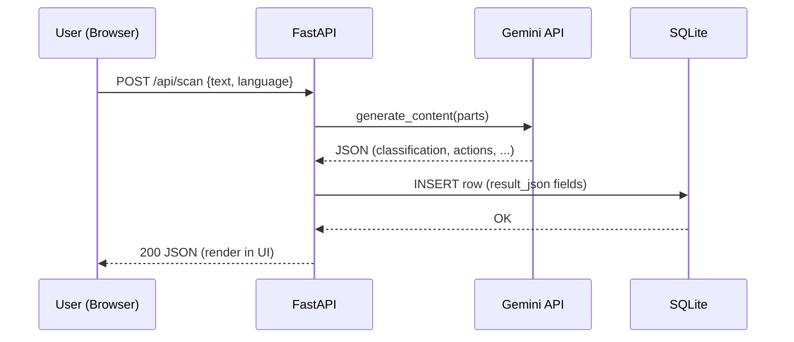
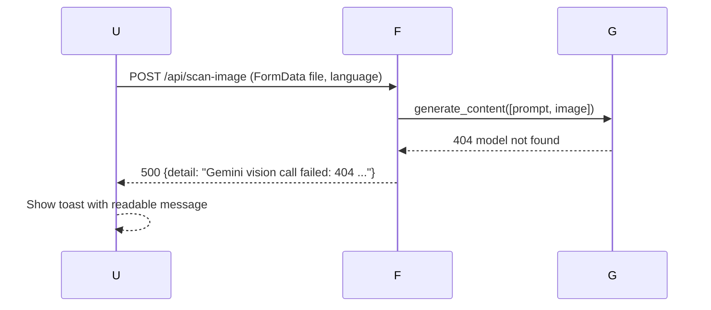

# 🧩 DESIGN.md — PhishNet Guardian Automation (MVP → Production)

> **Purpose.** This document describes the **system design** for *PhishNet Guardian*: a FastAPI + Vanilla JS application that detects and explains phishing/scam messages using Google Gemini, provides guided next steps, and stores results for dashboards and exports. It complements `README.md` (runbook) and `REQUIREMENTS.md` (what to build) with **how it is built**.

---

## 1) Goals & Non‑Goals
- **Goals**
  - Accurate, explainable classification for **text** and **screenshots** (Gemini‑only).
  - **Deterministic server responses**: always strict JSON, clear error messages on failure.
  - **Simple UI/UX**: paste text or upload image → see preview, analyze, view actions + quiz.
  - **Lightweight persistence** with **SQLite** for MVP dashboards/history.
- **Non‑Goals (MVP)**
  - User accounts/roles, multi‑tenant isolation, long‑term retention policies.
  - Heavy image storage, cloud OCR fallback, and offline processing queues.

---

## 2) High‑Level Architecture
```
Browser (HTML/CSS/JS)
   |  ├── POST /api/scan        (text)
   |  └── POST /api/scan-image  (image)
   v
FastAPI (Python)
   ├── ai/agent.py  → Gemini (model from .env)
   ├── Parse → validate → shape strict JSON
   └── SQLite (phishnet.db)
```
- **Gemini model name** is read from `.env` (`GEMINI_MODEL`, default `gemini-2.0-flash`).
- **Static UI** (`frontend/`) is mounted by FastAPI **after** API routes to avoid intercepting `/api/*`.

---

## 3) Component Design

### 3.1 Backend (FastAPI)
- **`backend/app/main.py`**
  - Endpoints: `/api/scan`, `/api/scan-image`, `/api/history`, `/api/history.csv`, `/api/stats`, `/api/health`.
  - DB bootstrap and inserts via a small helper `_persist_result()`.
  - **Error strategy**: wrap Gemini calls; on error, log traceback (server), return `HTTP 500` with **readable `detail`** string (client toast).
  - **StaticFiles**: `app.mount('/', StaticFiles(...), name='frontend')` declared **last**.

- **`backend/app/ai/agent.py`**
  - **Gemini‑only** (no fallback). Model created via `GenerativeModel(_model_name())` where `_model_name()` consults `.env`.
  - **Strict JSON**: model is prompted to return JSON only; response is parsed by `_safe_json_parse()` that extracts the first `{...}` block if extra text appears.
  - **Language control**: normalized `en|hi|mr`, enforced in the system prompt ("Respond STRICTLY in {lang}").
  - **Vision**: accepts raw bytes (`image/png|jpeg`), constructed as a multimodal parts list.

- **Security/Config**
  - `.env` read by `dotenv` at boot. Keys: `GEMINI_API_KEY` (required), `GEMINI_MODEL` (optional).
  - CORS open in dev (`*`); scope down for prod.

### 3.2 Frontend (Vanilla JS)
- **`frontend/index.html`**
  - Two forms: **Text** (`#scanForm`) and **Image** (`#imgForm`).
  - **Preview block** for images: `#imgPreviewWrap`, `#imgPreview`, `#imgName`, `#imgSize`.
  - KPI counters (`#totalScans`, `#scamCount`, `#suspCount`, `#safeCount`) and history container (`#history`).

- **`frontend/assets/script.js`**
  - **Analyze (text)** → POST `/api/scan` `{ text, language }`.
  - **Analyze (image)** → POST `/api/scan-image` `FormData(file, language)`.
  - **Image preview** using `URL.createObjectURL()`.
  - **Quiz**: clickable options with immediate feedback; shows explanation.
  - **Theme**: toggles `<html data-theme>`; persisted in `localStorage`.
  - **Stats/History** loaders call `/api/stats` & `/api/history` after each run and on init.

- **`frontend/assets/styles.css`**
  - Design tokens via CSS variables, light/dark palettes, card layout, pills, section blocks.
  - `.img-preview` rules for the thumbnail + meta.

### 3.3 Database (SQLite)
- Single table `scans` (see schema below). Serialized JSON stored for red flags, actions, trace for simplicity.

---

## 4) Sequence Diagrams

### 4.1 Text Analyze (success)


### 4.2 Image Analyze (error surfacing)


---

## 5) Data Model
```sql
CREATE TABLE IF NOT EXISTS scans (
  id INTEGER PRIMARY KEY AUTOINCREMENT,
  input_text TEXT,
  classification TEXT,     -- Safe|Suspicious|Scam
  risk_level TEXT,         -- Low|Medium|High|Critical
  confidence REAL,         -- 0..1
  red_flags_json TEXT,     -- JSON array
  actions_json TEXT,       -- JSON object {recommended_actions[], not_to_do[], plan[]}
  agent_trace_json TEXT,   -- JSON array
  created_at TEXT          -- ISO8601 UTC
);
```

**Notes**
- For image requests, `input_text` is a marker like `[screenshot upload]`.
- Indexes are not necessary for MVP volume; add later for analytics.

---

## 6) API Design (Concise)
- `POST /api/scan` → body `{text, language?}` → **200** structured JSON or **500** with `detail`.
- `POST /api/scan-image` → `FormData(file, language?)` → same response schema.
- `GET /api/history?limit=25` → list latest summaries.
- `GET /api/history.csv` → CSV export for analysts.
- `GET /api/stats` → `{ total, distribution }` for KPI cards.
- `GET /api/health` → `{ status, time }` for probes.

**Error Semantics**
- Gemini transport/permission/safety errors → `HTTP 500` with human‑readable `detail`.
- Client timeouts handled at fetch; button disabled while pending to avoid duplicate submits.

---

## 7) Prompting & JSON Robustness
- Use **simple parts list**: `[sys_prompt, "\nInput:", json.dumps(payload)]` to avoid fragile quoting.
- Explicit instruction: **"Respond STRICTLY in {lang} with JSON only"**.
- `_safe_json_parse()` extracts first JSON object if model adds extra text.

---

## 8) Internationalization
- Normalized languages: `en|hi|mr` from UI dropdown.
- Prompt enforces language; UI labels static; dynamic content (summary/actions/quiz) returned in selected language.

---

## 9) Security & Privacy
- `GEMINI_API_KEY` only in `.env`; never logged; avoid printing responses with sensitive text.
- Uploads are processed in memory; server does **not** persist images to disk.
- CORS liberal for local dev; tighten in prod.
- Rate limiting recommended in production (reverse proxy or app‑level).

---

## 10) Performance/Capacity (MVP)
- Typical free‑tier model latency: a few seconds per call; UI shows disabled state.
- SQLite handles single‑user demo volume easily; for higher traffic, switch to Postgres.

---

## 11) Observability
- Server prints stack traces for failures; client shows `detail` in toast.
- Add structured logging + request ids in production.

---

## 12) Deployment Topology
- **MVP**: single Uvicorn worker; static frontend mounted by FastAPI.
- **Production**: containerize; add NGINX/ALB; managed Postgres; object storage for uploads; secret manager; metrics/logs/traces.

---

## 13) Testing Strategy
- **Unit**: JSON parser, language normalizer, endpoints (FastAPI TestClient) with mocked Gemini SDK.
- **Integration**: end‑to‑end text & image flows; validate DB insert + history/stats.
- **Manual**: Hindi/Marathi verification; quiz click UX; theme persistence; preview correctness.

---

## 14) Risks & Mitigations
- **Model availability differences** → expose error; allow `.env` `GEMINI_MODEL` override.
- **Non‑JSON outputs** → strict prompt + resilient parser; surface raw head in error for debugging.
- **Rate limits/quota** → show readable message; suggest changing model/tiers.
- **DB lock/permissions** → keep DB in project root; close connections in finally; catch and report DB errors.

---

## 15) Backlog (Post‑MVP)
- User auth, per‑user histories.
- Admin dashboard (filters, time series, export presets).
- Postgres migration, Alembic migrations, connection pooling.
- S3/GCS upload storage; server‑side OCR fallback for low‑quality images.
- CI/CD workflows; IaC for repeatable infra.

---

## 16) File Map (as‑built)
```
backend/app/main.py            # API, DB, static mount
backend/app/ai/agent.py        # Gemini-only text & vision
frontend/index.html            # Forms, preview, KPIs, history
frontend/assets/script.js      # Calls, preview, quiz, stats
frontend/assets/styles.css     # Theme, layout, preview styles
phishnet.db                    # SQLite (auto)
.env                           # Keys & model selection
```

---

**© 2026 Radeon Rizers — PhishNet Guardian**
